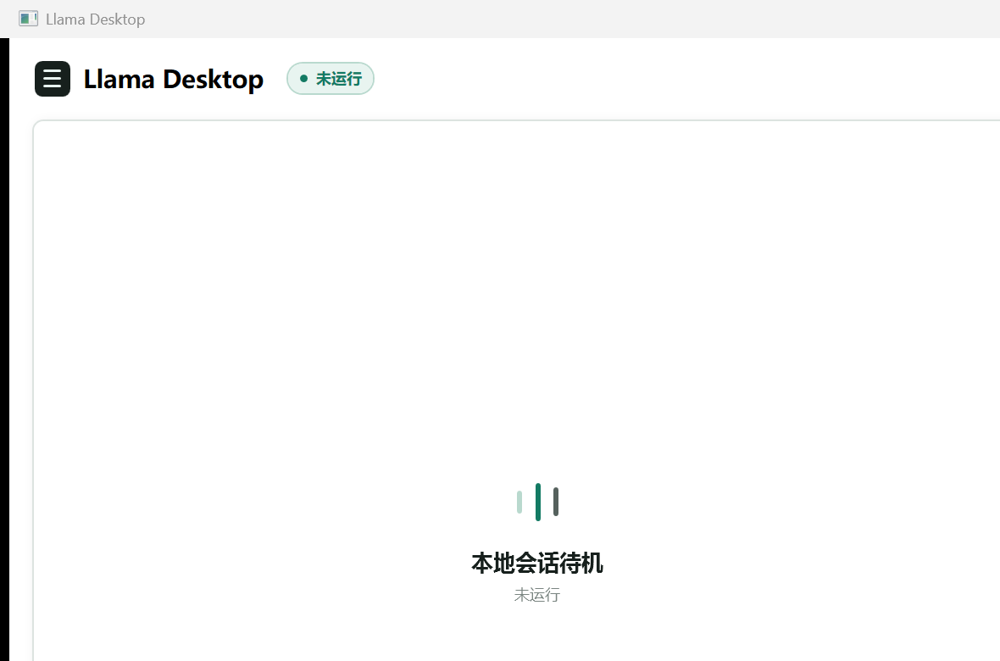

# Llama Desktop

**轻量便携 · 开包即用 · 零依赖的 llama.cpp 桌面管理壳**

A lightweight, portable, zero-dependency desktop shell for [llama.cpp](https://github.com/ggml-org/llama.cpp). Manage models, launch `llama-server`, and chat — all in one green, single-folder app. No Python, no Node.js, no .NET SDK, no installation.



---

## 为什么选 Llama Desktop / Why

| 特性 | 说明 |
|---|---|
| 🟢 **开包即用** | self-contained .NET 8 单文件夹发布，解压双击即用，无需安装任何运行时 |
| 💬 **内嵌聊天** | WebView2 直接内嵌 llama-server 官方 Web UI，无需切到浏览器 |
| 🎯 **自动推荐** | 检测 GPU/显存/内存，按硬件档位推荐上下文与 KV 量化，配合 `--fit` 自动显存适配 |
| 🔀 **Router 多模型** | `--models-dir` 多模型热切换，无需重启服务 |
| 🛡️ **安全生命周期** | PID 身份确认 + 三阶段停止（优雅 → 进程树 → 强制），绝不按进程名误杀 |
| 💾 **配置持久化** | 参数与侧栏收纳状态跨启动记住，损坏配置自动回退 |

## 快速开始 / Quick Start

> ⚠️ **便携包不含模型权重文件。** 请自备 GGUF 模型放入 `models\` 目录后启动（体积约 400MB～几十 GB，无法随包分发）。

1. 从 [Releases](../../releases) 下载 `llama-desktop-win-x64.zip`（绿色便携包，含 CUDA 版 `llama-server.exe`）。
2. 解压到任意目录（无需安装）。
3. 双击 `LlamaDesktop.exe`。
4. 选择 GGUF 模型（默认扫描 `models\` 目录）→ 点击「启动服务」。
5. 服务就绪后，聊天页在窗口内自动加载。

> 模型文件请自行放入 `models\` 目录；应用不内置模型下载。

## 系统要求 / Requirements

- Windows 10/11 x64
- Microsoft Edge WebView2 Runtime（Win10/11 默认已安装）
- NVIDIA GPU（CUDA 版运行时）；纯 CPU 可用但较慢

## 功能 / Features

- 模型扫描与浏览选择（文件名展示 + 悬停完整路径）
- 常用 + 高级参数：GPU 层数、上下文、线程、批大小、并行、Flash Attention、KV 量化、`--fit`、Thinking/Reasoning、额外参数
- 硬件检测与档位推荐（NVIDIA/AMD/Intel）
- 端口占用检测与候选端口顺延
- 实时日志尾读（UTF-8 增量解码，2000 行上限）
- 异步健康检查与就绪状态机
- 侧边栏收纳（150ms 动画，状态持久化）
- 外部链接拦截 + 仅允许本地服务导航

## 目录结构 / Layout

```
LlamaDesktop/
├─ LlamaDesktop.exe      # 桌面壳入口
├─ llama-server.exe      # llama.cpp CUDA 运行时
├─ *.dll                 # CUDA / WebView2 运行时依赖
├─ 启动Llama.cmd         # 兼容入口（旧 PowerShell 启动器）
├─ models/               # 放置 GGUF 模型
└─ docs/                 # 设计与架构文档
```

## 构建 / Build

```powershell
dotnet publish src/LlamaDesktop.App/LlamaDesktop.App.csproj `
  -c Release -r win-x64 --self-contained true -o dist/LlamaDesktop

# 打包绿色 zip
powershell -NoProfile -ExecutionPolicy Bypass -File scripts/package-release.ps1
```

技术栈：C# 12 · .NET 8 WPF · Microsoft WebView2

## License

[MIT](LICENSE)。`llama.cpp` 运行时及其依赖遵循其自身许可（见随包 `LICENSE-LLVM-OpenMP` 等）。
