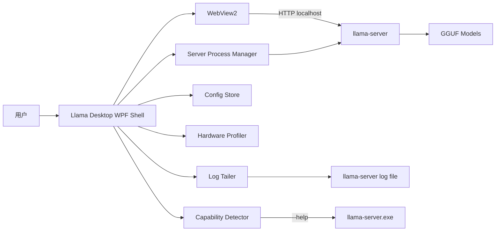
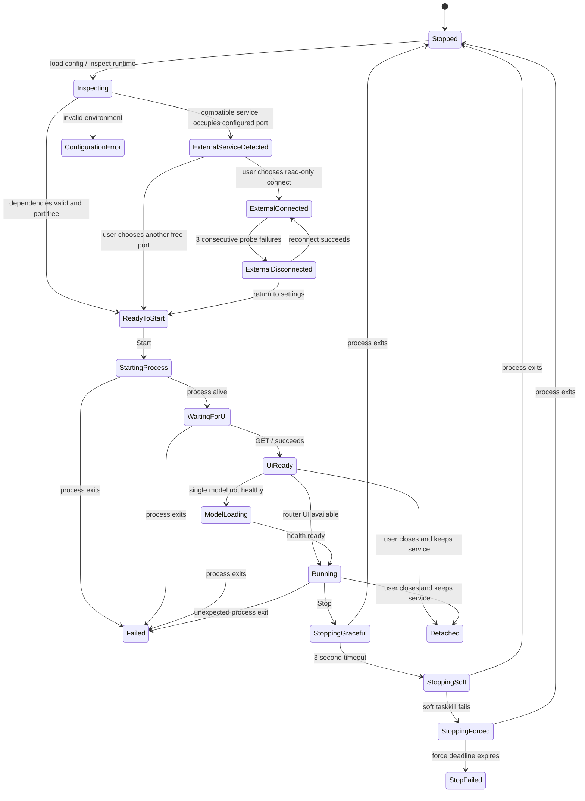

# Llama Desktop 工程架构设计

日期：2026-08-28
状态：待用户确认
目标版本：Llama Desktop v1

## 1. 摘要

在现有零安装 PowerShell/WPF 启动器基础上，新增一个现代桌面管理壳：使用 C#、.NET 8 WPF 和 Microsoft Edge WebView2，管理同目录的 `llama-server.exe`，并在桌面窗口中嵌入 llama-server 官方 Web UI。

v1 不重新实现聊天系统，不建设 Agent、终端或文件工具。重点是把模型管理、硬件分析、参数推荐、服务生命周期、Router 多模型、运行日志和官方聊天页面组合为一个可靠的桌面产品。

现有 `启动Llama.cmd`、`LlamaLauncher.ps1` 和 `Launcher.Core.psm1` 保持可用，作为兼容与故障恢复入口。新桌面端不在第一阶段删除或重写它们。

## 2. 已确认约束

- 目标平台仅为 Windows x64。
- 允许依赖系统 Microsoft Edge WebView2 Runtime。
- 本机已检测到 WebView2 Runtime `151.0.4129.107`。
- 用户运行时不需要安装 .NET；发布物使用 .NET 8 self-contained 模式。
- 使用当前目录中的 llama.cpp Windows 运行时和 GGUF 模型。
- 聊天区域使用 llama-server 官方 Web UI，不在 v1 自研聊天历史、Markdown 渲染或流式协议。
- 服务默认只监听回环地址。
- 仅管理由本桌面端启动且身份可确认的进程，不按进程名终止服务。
- 配置中不得保存密钥、令牌或其他敏感数据。

## 3. 目标与非目标

### 3.1 目标

1. 提供接近桌面 Harness 的单窗口工作体验。
2. 在一个窗口内完成模型选择、服务启动、聊天、日志查看和停止。
3. 支持单模型模式和 Router 多模型模式。
4. 检测 CPU、内存、GPU 和显存，并给出可解释的参数建议。
5. 根据当前 `llama-server --help` 探测能力，避免对不同版本传递不支持的参数。
6. 保留用户手动控制权；自动调参只生成建议，不静默覆盖用户配置。
7. 服务和 WebView2 故障必须可诊断、可恢复。
8. 使用文件夹发布，可整体复制到其他 Windows x64 机器。

### 3.2 非目标

- 自研聊天前端或会话数据库。
- 文件读写、终端执行、MCP、工具调用和 Agent 工作流。
- 模型下载、转换、量化或更新器。
- 同时管理多台远程机器。
- 对公网暴露服务或管理反向代理。
- 自动选择并执行网络下载的 `llama-server`。
- 自动执行远程 PowerShell 安装脚本。
- v1 支持 Windows ARM64、Linux 或 macOS。

## 4. 关键架构决策

### 4.1 桌面技术栈

采用：

- C# 12
- .NET 8 WPF，目标框架 `net8.0-windows`
- Microsoft.Web.WebView2
- x64 self-contained 文件夹发布
- 不启用 trimming；WPF 和 WebView2 在裁剪模式下风险较高
- 不强制 single-file；保留 WebView2 托管程序集和原生 loader 的清晰目录结构

不采用纯 PowerShell WebView2 宿主。PowerShell 加载 WebView2 WPF 控件虽然可行，但程序集解析、原生 loader、异步生命周期、测试和异常恢复都更脆弱。

不采用 Electron。v1 只嵌入官方 Web UI，Electron 带来的 Chromium、Node.js、打包和内存成本没有足够收益。

### 4.2 UI 架构

采用 MVVM，但不引入大型框架。应用通过 Composition Root 手动组装服务；ViewModel 使用小型 `ObservableObject` 和命令实现，避免服务定位器和静态全局状态。

主窗口采用三段布局：

```text
+------------------------------------------------------------------+
| 标题栏 | 服务状态 | 当前模型 | GPU/内存摘要 | 设置               |
+------------------+-----------------------------------------------+
| 模型与服务面板    |                                               |
|                  |                                               |
| 单模型 / Router   |          llama-server 官方 Web UI             |
| 模型/目录选择     |                 WebView2                       |
| 推荐参数          |                                               |
| 上下文 / KV       |                                               |
| Thinking / Fit    |                                               |
| 启动 / 停止       |                                               |
+------------------+-----------------------------------------------+
| 可折叠：实时日志 | 实际参数 | Slots/Metrics                        |
+------------------------------------------------------------------+
```

WebView2 未就绪时由原生 WPF 覆盖层显示状态，不使用远程网页作为加载页。

### 4.3 llama-server UI 策略

- 启动时显式启用 `--ui`。
- 单模型模式传递 `--model <path>`。
- Router 模式传递 `--models-dir <path>` 和受支持的 `--models-max`。
- WebView2 在 HTTP UI 可访问后导航到本地服务根地址。
- WebView2 使用持久化 User Data Folder，因此官方 UI 的本地设置可跨启动保留。
- 桌面端不依赖官方 UI 的内部 DOM，不注入脚本，不修改其前端资源。

不依赖 DOM 是重要兼容边界：llama.cpp 更新 Web UI 时，桌面端只要求根页面可访问，而不要求特定按钮、元素 ID 或内部路由保持不变。

## 5. 系统上下文



## 6. 解决方案结构

```text
src/
  LlamaDesktop.App/
    App.xaml
    App.xaml.cs
    ShellWindow.xaml
    ShellWindow.xaml.cs
    Presentation/
      ViewModels/
        ShellViewModel.cs
        ServerPanelViewModel.cs
        HardwareViewModel.cs
        LogViewModel.cs
      Controls/
        ServerPanel.xaml
        StatusBar.xaml
        LogDrawer.xaml
      Converters/
    Web/
      WebViewHost.cs
      NavigationPolicy.cs
    CompositionRoot.cs

  LlamaDesktop.Core/
    Models/
      LauncherConfig.cs
      ServerSettings.cs
      HardwareSnapshot.cs
      CapabilitySnapshot.cs
      Recommendation.cs
      ModelDescriptor.cs
      ProcessIdentity.cs
    Services/
      IServerController.cs
      ICapabilityDetector.cs
      IHardwareProfiler.cs
      IRecommendationEngine.cs
      IPortAllocator.cs
      IConfigStore.cs
      IModelCatalog.cs
      IHealthMonitor.cs
      ILogReader.cs
    Validation/
      SettingsValidator.cs
      ExtraArgumentPolicy.cs
    Arguments/
      ServerArgumentBuilder.cs
      WindowsArgumentQuoter.cs

  LlamaDesktop.Infrastructure/
    Processes/
      LlamaServerController.cs
      ProcessTreeTerminator.cs
      ServerCapabilityDetector.cs
    Hardware/
      WindowsHardwareProfiler.cs
      NvidiaSmiProbe.cs
      WindowsDisplayAdapterProbe.cs
    Network/
      WindowsPortAllocator.cs
      LlamaHealthMonitor.cs
    Persistence/
      JsonConfigStore.cs
      LegacyConfigImporter.cs
    Models/
      FileSystemModelCatalog.cs
      RouterPresetWriter.cs
    Logging/
      IncrementalUtf8LogReader.cs

tests/
  LlamaDesktop.Core.Tests/
  LlamaDesktop.Infrastructure.Tests/
  LlamaDesktop.App.Tests/
  LlamaDesktop.E2E.Tests/

legacy/
  Launcher.Core.psm1
  LlamaLauncher.ps1
  启动Llama.cmd
```

`legacy/` 仅表示新 solution 中对旧源码的归档位置；构建发布时必须把这三个文件复制到发布根目录，与 `llama-server.exe` 同级，保持其 `$PSScriptRoot` 行为。初次迁移阶段可直接保留现有三个文件在仓库和应用根目录，目录整理只在发布复制规则稳定后执行。

## 7. 模块职责

### 7.1 LlamaDesktop.App

只负责：

- WPF 窗口与 ViewModel 绑定
- 用户操作编排
- WebView2 生命周期
- 原生加载/错误覆盖层
- 可折叠日志面板
- 关闭窗口时的选择对话框

不得在 code-behind 中组装 llama-server 参数、解析硬件信息或直接读写 JSON。

### 7.2 LlamaDesktop.Core

纯业务层，不依赖 WPF、WebView2、注册表或具体文件系统。负责：

- 设置模型和默认值
- 设置校验
- 参数能力与用户设置的合并
- 参数构造
- 敏感参数和受管理参数拒绝
- 推荐规则
- 服务状态定义

该项目是主要单元测试边界。

### 7.3 LlamaDesktop.Infrastructure

负责所有 Windows 和 I/O 细节：

- 启动和停止进程
- PID/启动时间身份确认
- `taskkill` 降级路径
- HTTP 探测
- WebView2 Runtime 检测
- `nvidia-smi`、CIM 和注册表硬件探测
- 端口和排除端口段检测
- 配置文件原子写入
- 增量 UTF-8 日志读取
- 模型目录递归扫描（`models\**\*.gguf`，忽略 `Modelfile.*` 等非权重文件）

### 7.4 WebViewHost

WebView2 必须封装在单独适配器中，暴露以下高层操作：

```csharp
Task InitializeAsync(string userDataFolder, CancellationToken cancellationToken);
Task NavigateToServiceAsync(Uri baseUri, CancellationToken cancellationToken);
void ShowNativePlaceholder(WebPlaceholderState state, string? detail);
Task ClearBrowsingDataAsync();
```

ViewModel 不直接操作 `CoreWebView2`。

## 8. 服务状态机



### 8.1 状态语义

- `UiReady`：HTTP 根页面可访问；不等同于模型已加载。
- `Running`：单模型模式下 `/health` 成功；Router 模式下表示 Router UI 可用。Router 的当前模型加载状态作为独立的 `ActiveModelState` 展示，不与服务生命周期状态混用。
- `Detached`：桌面端放弃管理该进程后退出。下次启动按 8.5 的外部服务识别路径处理，不假设拥有停止权。
- `Failed`：保留退出码和日志尾部，恢复设置可编辑状态。
- `StopFailed`：服务仍存活，必须明确提示 PID，不得伪装为已停止。

### 8.2 进程所有权不变量

桌面端只在以下条件全部成立时显示可用的“停止”操作：

1. 进程由当前应用实例启动；
2. 保存了 PID 和启动时间；
3. 操作前重新读取的 PID 启动时间仍匹配；
4. 尚未执行 Detach。

绝不使用 `taskkill /IM llama-server.exe` 或按进程名批量终止。

### 8.3 应用根目录不变量

应用根目录固定为 `Path.GetFullPath(AppContext.BaseDirectory)`，不得使用 `Environment.CurrentDirectory`。所有相对路径（`llama-server.exe`、模型、旧配置和发布依赖）均相对该目录解析。快捷方式、任务栏和其他工作目录启动方式不得改变扫描结果。

### 8.4 单实例规则

每个应用根目录只允许一个桌面实例。互斥量名称为 `Local\LlamaDesktop-{SHA256(normalizedAppRoot)[0..16]}`。第二实例检测到互斥量后显示“该目录的 Llama Desktop 已在运行”并退出；v1 不实现跨进程窗口激活。不同应用根目录可以分别运行。

### 8.5 外部服务与重新连接

启动检查发现配置端口已被占用时，不能立即假设冲突或获得进程所有权：

1. 请求服务根页面；
2. 请求 `/v1/models` 并验证 OpenAI-compatible 列表响应形状；
3. 两项均符合时进入 `ExternalServiceDetected`，让用户选择“只读连接”或“换端口启动”；
4. 只读连接进入 `ExternalConnected`，WebView2 可以导航到该服务，但停止按钮和进程日志保持禁用；
5. 健康探测连续三次失败后进入 `ExternalDisconnected`，显示重新连接或返回设置；
6. 不能确认是兼容服务时按 `PortConflict` 处理。

“保持服务运行并退出”后，下次启动同样走这条外部服务识别路径。即使 PID 与上次记录相同，新应用实例也不得恢复停止权。v1 不附加外部服务的日志文件。

## 9. 启动数据流

1. 加载配置并执行 schema 迁移。
2. 扫描根目录 `llama-server.exe`，不得递归选择任意同名程序。
3. 读取或刷新 capability cache。
4. 递归扫描模型目录（`models\**\*.gguf`）。
5. 异步采集硬件信息。
6. 根据硬件、模型和 server 能力产生推荐，但不自动覆盖已保存设置。
7. 用户选择单模型或 Router 模式并点击启动。
8. 校验文件、参数、主机、端口和额外参数。
9. 选择并再次检查端口。
10. 将配置原子写入磁盘。
11. 构造参数数组和可审计的显示命令。
12. 启动隐藏的 `llama-server.exe`，记录 PID 与启动时间。
13. 使用 `--log-file`，从文件持续增量读取 UTF-8 日志。
14. 异步探测 HTTP 根页面；探测间隔 1 秒，单次超时 1 秒，不设置模型加载总超时。
15. UI 可访问后，host 为回环地址时显示 WebView2；非回环地址时显示原生说明页和“用系统浏览器打开”按钮。
16. 单模型模式继续探测 `/health`；Router 模式允许官方 UI 自行触发模型加载。

## 10. 能力探测

每个 llama.cpp 版本可能改变参数。桌面端启动时执行一次：

```text
llama-server.exe --help
```

解析为 `CapabilitySnapshot`，至少包含：

- Web UI
- Router models directory
- Router model limit
- Router preset
- `--fit` 和 `--fit-target`
- Flash Attention 语法
- K/V cache type
- Jinja
- reasoning mode、budget、format
- metrics
- slots
- load mode
- `--log-file`
- `/health` endpoint
- `/v1/models` endpoint
- `--n-gpu-layers` 值语法（`all` 关键字是否支持）

缓存键由以下字段组成：

- 规范化 executable path
- 文件长度
- 最后修改时间 UTC
- 文件版本（若存在）

任何字段变化都重新探测。解析失败时只启用已验证的基础参数，不猜测未知参数。

### 10.1 能力门控规则

以下行为不得无条件执行，必须先由 `CapabilitySnapshot` 确认：

- 传 `--log-file`：能力缺失时改用进程 stdout/stderr 捕获，日志抽屉仍可用。
- 探测 `/health`：能力缺失时单模型模式以 `UiReady` 作为最高可判定状态，不再等待 `Running`。
- 请求 `/v1/models`：能力缺失时禁用外部服务识别与 `/v1/models` 校验。
- GPU layers `all` 关键字：能力缺失时改为数值 `-1`（若探测支持）或回退自动策略。
- `--n-gpu-layers` 的具体值语法：按探测结果映射 `all`、数值或省略。

任何探测失败都不因推荐参数产生致命启动失败；用户手动模式始终可用。

## 11. 硬件分析与推荐

### 11.1 硬件探测

- NVIDIA：优先 `nvidia-smi --query-gpu=name,memory.total`。
- AMD/Intel：CIM 获取设备，注册表尝试获取显存。
- CPU：物理核心与逻辑处理器分别记录。
- RAM：记录总内存，不要求管理员权限。
- 多 GPU：保留每张卡的独立快照，不只取第一张卡。
- 探测失败返回“不确定”，不得当成零显存并自动切纯 CPU。

### 11.2 推荐原则

推荐引擎输出：

```text
Recommendation
  Profile: Conservative | Balanced | Maximum | Manual
  ProposedSettings
  Confidence: High | Medium | Low
  Reasons[]
  Warnings[]
```

推荐只在用户点击“应用推荐”后写入编辑控件。已有保存配置不会因硬件探测结果被静默修改。

首版建议规则：

- GPU 可用且支持 `--fit`：优先 `--fit on`。
- 不支持 `--fit`：建议 GPU layers `all`，但标注可能 OOM。
- 低显存档位建议较小上下文。
- 仅在能力探测确认后建议 `q8_0` KV cache。
- Thinking 开启时提高最大生成长度建议，但不强制采样参数。
- RAM 不足时给出风险提示，不擅自降低用户保存的上下文。

参考脚本中的显存档位可作为初始经验数据，但必须放在纯规则表和单元测试中，不能散落在 UI 代码。

## 12. 单模型与 Router 模式

### 12.0 模型位置约定

模型根目录固定为 `<应用根目录>\models\`。

- 使用递归扫描 `models\**\*.gguf` 发现权重，不限制在根目录。
- 每个模型通常位于自己的子目录，例如：

```text
models\
  Qwen3.6-35B-A3B-Uncensored-HauhauCS-Aggressive-Q3_K_P\
    Qwen3.6-35B-A3B-Uncensored-HauhauCS-Aggressive-Q3_K_P.gguf
    Modelfile.qwen3.6-35b-uncensored-q3-k-p      # Ollama 产物，忽略
```

- 子目录内可能同时存在多分片 GGUF、多模态 `mmproj` 投影，或 Ollama `Modelfile.*`。
- 桌面端只识别 `.gguf` 权重文件；忽略 `Modelfile.*`、`.json`、`.md` 等非权重文件。
- 多分片模型按 llama.cpp 自身规则加载，桌面端不自行组合分片。
- 单模型模式的默认模型为：已保存的模型路径（若仍存在且为 `.gguf`），否则递归扫描到的第一个 `.gguf`。
- legacy 启动器使用非递归扫描，模型移入子目录后将扫不到；详见 26 的迁移说明。

### 12.1 单模型模式

- 用户选择一个 `.gguf` 文件（可位于 `models\` 任意子目录）。
- 参数包含 `--model <绝对路径>`。
- `/health` 成功后状态为 Running。
- 更适合稳定运行和固定 API 使用。

### 12.2 Router 模式

- 用户选择模型根目录 `models\`。
- 参数包含 `--models-dir`。
- 可选传递 `--models-max` 和 `--models-preset`。
- HTTP UI 可访问即进入可交互状态；模型由官方 UI 按需加载。
- 模型目录中的多模态附件和分片模型按 llama.cpp 自身规则处理，桌面端不自行组合模型文件。

### 12.3 模型预设

应用内部配置使用 JSON，不直接让 UI 编辑 INI。启动前由 `RouterPresetWriter` 生成 llama-server 所需 INI。

预设名称解析顺序：

1. 优先读取 GGUF metadata 中 llama.cpp 识别的模型名；
2. 无法从 metadata 可靠解析时，使用文件名去扩展名作为候选名称；
3. 仍然不确定时不生成该段，并提示用户在首次加载后的 Router 模型列表中绑定名称。

启动后如果 llama-server 日志显示 `Loaded 0 custom model presets` 或明确拒绝 INI 段名，桌面端在日志抽屉提示，不重试、不静默改写服务参数。

不生成参考脚本中已知无效的 `[*]` 通配段。

## 13. 配置与持久化

### 13.1 存储位置

默认使用：

```text
%LOCALAPPDATA%\LlamaDesktop\
  config.json
  capabilities.json
  logs\
  webview2\
  generated\models-presets.ini
```

应用二进制、llama.cpp DLL 和模型仍位于便携目录。将可变数据放入 LocalAppData，避免应用位于只读目录时写入失败。

后续可通过 `portable.flag` 增加完全便携模式，但不列入 v1 必需范围。

### 13.2 配置模型

```json
{
  "schemaVersion": 2,
  "serverMode": "single",
  "modelPath": "models/example.gguf",
  "modelsDirectory": "models",
  "host": "127.0.0.1",
  "port": 8080,
  "autoSelectPort": true,
  "gpuLayers": "all",
  "contextSize": 8192,
  "threads": 16,
  "batchSize": 2048,
  "parallel": 1,
  "flashAttention": "on",
  "fitMode": "on",
  "fitTargetMiB": 2048,
  "cacheTypeK": "q8_0",
  "cacheTypeV": "q8_0",
  "reasoningMode": "off",
  "maxPredict": 8192,
  "modelsMax": 1,
  "extraArguments": "",
  "ui": {
    "logDrawerOpen": false,
    "leftPanelWidth": 300
  }
}
```

配置模型说明：

- `modelPath` 和 `modelsDirectory` 的 `models/...` 相对路径按 8.3 应用根目录解析为绝对路径后再传递给 llama-server。
- `modelPath` 可为 `models\` 任意深度的 `.gguf` 文件；当前仓库默认模型为 `models\Qwen3.6-35B-A3B-Uncensored-HauhauCS-Aggressive-Q3_K_P\Qwen3.6-35B-A3B-Uncensored-HauhauCS-Aggressive-Q3_K_P.gguf`。
- `modelsDirectory` 固定指向模型根目录 `models\`，Router 模式递归扫描其下所有 `.gguf`。
- `threads` 的默认值是启动时检测到的逻辑处理器数，`16` 仅为示例；用户显式保存后不再随硬件变化。
- `gpuLayers` 的 `all` 关键字仅在能力探测确认支持时使用，否则映射为数值 `-1` 或省略。
- `flashAttention` 的 `on` 值仅在新版参数语法支持时传递；旧版按能力探测切换为纯 flag 或关闭。
- `fitMode`、`cacheTypeK/V`、`reasoningMode` 等推荐字段在能力不支持时不得被传入命令行。

配置读取规则：

- 未知字段忽略。
- 缺失字段使用默认值。
- 类型错误字段使用默认值并记录警告。
- schemaVersion 逐版本迁移。
- 使用临时文件、flush、原子替换。
- 不保存 API key、HF token 或其他密钥。

### 13.3 旧配置迁移

首次启动时如不存在 v2 配置但根目录存在 `launcher-config.json`：

1. 只读旧文件；
2. 映射兼容字段；
3. 严格校验类型；
4. 写入新配置；
5. 不删除或修改旧配置；
6. 记录迁移结果。

## 14. 端口策略

参考作品的候选端口与系统排除端口检测值得保留，但实现必须闭环：

1. 检查用户指定端口是否合法。
2. 读取 Windows TCP excluded port ranges。
3. 尝试 bind 检测端口是否可用。
4. `autoSelectPort=false` 时冲突立即报错。
5. `autoSelectPort=true` 时依次尝试配置端口和候选端口。
6. 候选端口顺序固定为：`8080, 8090, 8081, 8188, 11434, 18080`；首个同时避开系统排除段且 bind 成功的端口被选用。
7. 选出的最后端口仍必须再次检查，不能无条件回退到 `18080`。
8. 端口检查和真正启动存在竞争窗口；若 server 日志显示 bind 失败，报告冲突并允许重新启动，不伪装为模型加载失败。

## 15. WebView2 安全边界

- 初始化前检测 Evergreen WebView2 Runtime。
- Runtime 缺失时显示官方下载说明，不自动执行远程安装脚本。
- User Data Folder 固定在应用数据目录。
- 允许的 WebView2 主页面 origin 仅限回环地址（`127.0.0.1`、`localhost`、`[::1]`）和当前服务端口。
- 当配置 host 为非回环地址（例如局域网 IP）时，WebView2 不回退到 `0.0.0.0`，而是：显示原生说明页并提供“用系统浏览器打开”按钮，聊天不内嵌；服务仍按用户配置绑定。
- 导航到其他 HTTP/HTTPS origin 时取消 WebView 内导航并交给系统浏览器。
- 拒绝 `file:`、`data:`、`javascript:` 等非预期导航。
- 拦截新窗口请求。
- 发布版本默认禁用 DevTools；可通过诊断设置临时开启。
- 默认禁用状态栏和不需要的浏览器 UI。
- 不通过 WebView2 向网页暴露任意本地 COM/.NET 对象。
- 不注入能访问文件系统的 host object。
- 服务监听地址改为非回环地址时显示明确安全警告。

## 16. 额外参数安全策略

桌面端管理以下参数，额外参数不得覆盖：

- model / models-dir
- host / port
- log-file
- GPU layers / fit
- context / threads / batch / parallel
- Web UI 开关
- Router preset / models-max
- cache types
- reasoning mode

额外参数拒绝敏感与危险选项，包括但不限于：

- `--api-key`
- `--api-key-file`
- `--hf-token`
- `--path`（通过 HTTP 提供任意本地目录，扩大暴露面）
- `--log-disable`（破坏日志尾随器）

同时拒绝 `--option=value` 和分离值两种形式。错误必须在保存配置和启动前同时拦截。

## 17. 日志与诊断

继续使用 `--log-file`，原因是用户关闭桌面壳后可选择保留服务器运行。直接绑定 stdout/stderr 会让 detached 生命周期复杂化。当能力探测表明不支持 `--log-file` 时，回退为捕获进程 stdout/stderr 并按同样的行数上限展示。

日志读取要求：

- FileShare.ReadWrite
- 保存 byte offset
- 使用持久 UTF-8 Decoder 处理跨块多字节字符
- 文件截断或轮换时重置 offset 和 decoder
- UI 只保留固定行数
- 支持复制日志和打开日志目录
- 日志中显示时间、进程 PID、实际参数、状态转换和退出码
- 显示命令必须对路径进行 Windows 参数转义
- 若未来支持密钥，显示命令必须先脱敏

日志保留策略：

- 服务日志写入 `logs\launcher-server.log`。
- 单文件超过 50 MB 时归档为 `launcher-server.{timestamp}.log`，最多保留 3 个归档，之后删除最旧归档。
- 归档发生在服务停止或应用启动时，避免频繁打断正在写入的日志。
- detached 服务由 llama-server 自身继续写日志；桌面端在下次识别外部服务时仍只显示说明，不接管历史日志。

### 17.1 诊断与设置界面

主窗口设置菜单提供：

- 复制 API 地址（复制当前服务 `/v1` 地址到剪贴板）。
- 打开日志目录。
- 复制当前实际启动命令（已脱敏、已按 Windows 规则转义）。
- 临时开启/关闭 WebView2 DevTools（仅诊断，不持久化）。
- 清除 WebView2 浏览数据。
- 关于：显示应用版本、server 路径、WebView2 Runtime 版本和配置目录。

诊断信息不单独做成独立窗口；错误详情统一进入日志抽屉，避免维护两套错误展示。

## 18. 错误处理

错误分为：

1. `ConfigurationError`：字段、文件、受管理参数冲突。
2. `EnvironmentError`：server、WebView2 Runtime 或依赖 DLL 缺失。
3. `PortConflict`：端口占用或系统排除。
4. `StartupFailure`：进程在 UI/模型就绪前退出。
5. `RuntimeFailure`：曾经运行后异常退出。
6. `WebViewFailure`：WebView2 初始化、导航或渲染失败。
7. `StopFailure`：停止期限结束后服务仍存活。

每个错误对象包含：

```text
Code
UserMessageChinese
TechnicalDetail
SuggestedAction
Exception (diagnostic only)
```

UI 显示可操作的中文消息；技术详情进入日志抽屉。

## 19. 关闭行为

服务运行时关闭主窗口，显示三个选项：

- 停止服务后退出；
- 保持服务运行并退出；
- 取消。

选择停止：窗口保持存活并显示停止进度，直到服务退出或停止失败。

选择保持后台：清除进程所有权，停止日志和健康任务，关闭 WebView2，不终止服务。

选择取消：不改变服务和窗口状态。

WebView2 初始化或崩溃不得影响服务停止按钮的可用性。

## 20. 测试架构

### 20.1 Core 单元测试

必须覆盖：

- 默认配置和 schema 迁移
- 类型错误回退
- 参数范围校验
- Windows 参数转义
- managed/sensitive 参数拒绝
- 单模型和 Router 参数构造
- capability 与配置合并
- 硬件推荐规则和置信度
- 状态机合法/非法转换

### 20.2 Infrastructure 测试

使用临时目录和伪 server 进程覆盖：

- 配置原子保存
- 旧配置导入
- UTF-8 跨块日志解码
- 日志截断
- PID + 启动时间身份检查
- 端口占用与排除端口
- capability help 解析
- 进程异常退出
- 停止超时和 taskkill helper 超时

### 20.3 WebView2 集成测试

使用本地临时 HTTP server：

- Runtime 初始化
- 本地 origin 导航成功
- 外部 origin 被拦截
- 新窗口被交给系统浏览器适配器
- HTTP server 退出后显示原生恢复页
- User Data Folder 可重复初始化

测试不依赖 llama-server 官方 DOM。

### 20.4 App 层测试范围

`LlamaDesktop.App.Tests` 覆盖 ViewModel 与命令：

- ShellViewModel 状态编排
- 命令 CanExecute 与状态映射
- 启动/停止/关闭流程的 ViewModel 逻辑
- 错误对象到用户消息的映射
- Composition Root 的依赖装配（不启动真实 WPF 窗口）

完整 WPF UI 自动化（视觉树交互、拖拽、关闭对话框）不属于 v1 自动化范围，改为 20.6 的人工验收。

### 20.5 真实集成测试

保留一条手动/夜间测试：

- 使用当前 GGUF 启动单模型服务
- 根 UI 可访问
- `/health` 为 200
- `/v1/models` 返回模型
- WebView2 显示非空页面
- 停止后 PID 退出且端口释放
- Router 模式列出模型并可在官方 UI 触发加载

### 20.6 人工验收

- 高 DPI 和 100/125/150/200% 缩放
- 窗口最小尺寸无重叠
- Yes/No/Cancel 关闭流程
- 外部链接行为
- 复制 API 地址
- 日志抽屉长时间运行
- GPU/RAM 推荐文案可理解

## 21. 发布布局

```text
LlamaDesktop/
  LlamaDesktop.exe
  LlamaDesktop.Core.dll
  LlamaDesktop.Infrastructure.dll
  Microsoft.Web.WebView2.Core.dll
  Microsoft.Web.WebView2.Wpf.dll
  runtimes/win-x64/native/WebView2Loader.dll
  llama-server.exe
  ggml-*.dll
  CUDA/Vulkan runtime DLLs
  models/
  启动Llama.cmd
  LlamaLauncher.ps1
  Launcher.Core.psm1
```

构建机需要 .NET 8 SDK；用户机器不需要 .NET SDK 或 Runtime。WebView2 Evergreen Runtime 是唯一系统依赖。

发布流程必须校验：

- x64 架构一致
- WebView2Loader.dll 存在
- llama-server 依赖 DLL 完整
- legacy 文件编码为 UTF-8 BOM
- 压缩包从全新目录解压后可启动

## 22. 分阶段实施

### Phase 0：架构骨架与行为基线

- 创建 solution 和三个生产项目
- 建立 Core 测试
- 将现有 PowerShell 行为整理为验收用例
- 保留 legacy 启动器不变

预计：1–2 人日。

### Phase 1：桌面壳和单模型闭环

- WPF Shell
- WebView2 host 和导航白名单
- 单模型配置
- 进程、健康、日志和停止状态机
- 旧配置导入
- self-contained 发布

预计：5–7 人日。

### Phase 2：硬件与智能建议

- 多 GPU/CPU/RAM 探测
- capability cache
- `--fit`、KV cache、Thinking 建议
- 推荐解释和一键应用
- 保留完整手动模式

预计：3–5 人日。

### Phase 3：Router 多模型

- Router 模式
- 模型目录和模型上限
- JSON 模型 profile
- 生成 INI preset
- Router 状态与真实集成测试

预计：3–5 人日。

### Phase 4：产品化验证

- 高 DPI 和窗口布局
- WebView2 故障恢复
- 发布包全新目录测试
- 完整人工验收
- 文档和故障排查页

预计：2–3 人日。

MVP（Phase 0–1）：约 6–9 人日。

完整 v1（Phase 0–4）：约 14–22 人日。实际工期取决于 WebView2 宿主测试、llama.cpp 版本差异和 Router preset 的真实行为。

## 23. 主要风险与缓解

| 风险 | 影响 | 缓解 |
|---|---|---|
| llama.cpp 参数持续变化 | 启动失败 | `--help` 能力探测、按二进制身份缓存 |
| 官方 Web UI 内部变化 | 页面异常 | 不依赖 DOM，只依赖 HTTP 根页面 |
| WebView2 Runtime 缺失或损坏 | 无法显示聊天 | 启动检查、原生错误页、外部浏览器后备按钮 |
| 自动调参不适配特定模型 | OOM 或性能差 | 只提供建议、显示理由、允许回退手动模式 |
| 多 GPU 信息探测不完整 | 推荐错误 | 保留 Unknown 状态，不把失败当零显存 |
| Router 健康语义不同 | 状态误判 | 服务生命周期与 `ActiveModelState` 分离 |
| 端口检查存在 TOCTOU | 偶发 bind 失败 | 识别 bind 日志并返回 PortConflict |
| detached 服务失去管理 | 用户难以停止 | 关闭前明确提示 PID 和 API 地址；下次只允许连接，不冒认所有权 |
| self-contained 包体积增加 | 分发成本 | 接受约 80–120 MB 桌面运行时开销，不使用 Electron |

## 24. 从参考作品吸收与拒绝的清单

### 吸收

- NVIDIA/AMD/Intel 硬件探测
- RAM 与物理核心探测
- 系统保留端口检查
- 参数能力探测
- Router 模式
- `--fit`、KV cache、Thinking 联动
- 模型 preset 思路
- 模型目录为空时提供明确指导

### 改进后吸收

- 显存档位改为可解释建议，不强制写入
- 端口候选必须逐个实际验证
- 多 GPU 分别建模
- preset 由 JSON 模型生成有效 INI
- UI 和模型就绪分成两个状态

### 明确拒绝

- `Invoke-RestMethod | Invoke-Expression`
- 自动通过 winget 改变用户系统
- 递归挑选任意同名 server executable
- 最后端口未经验证直接使用
- 仅靠 TCP 判定模型可用
- 依赖黑色控制台窗口管理生命周期
- 无效 `[*]` preset 段

## 25. 验收标准

1. 从发布目录启动 `LlamaDesktop.exe`，无需安装 .NET。
2. WebView2 Runtime 存在时，在同一窗口显示官方 llama Web UI。
3. Runtime 缺失时显示可操作的原生错误页，并可改用外部浏览器。
4. 单模型模式能加载当前 GGUF，状态依次正确转换。
5. Router 模式能发现模型并打开官方模型选择界面。
6. 硬件探测失败不阻止手动启动。
7. 推荐配置必须展示依据，并由用户主动应用。
8. 不支持的 server 参数不会被传入。
9. 日志中文不会因分块读取损坏。
10. 只停止应用拥有的 PID；停止后端口释放。
11. 选择保留后台服务后，关闭桌面端不会停止 server。
12. WebView2 不允许导航到未授权 origin。
13. 损坏配置回退到安全默认值并显示警告。
14. 现有 PowerShell 启动器仍可独立工作。

## 26. 实施交接原则

下一实现模型应按 Phase 0 到 Phase 4 顺序推进，并遵循：

- 先建立 Core 状态机和参数构造测试，再实现 WPF。
- 不在第一批提交中修改 legacy 启动器。
- 不把硬件探测或 `--help` 解析写进 ViewModel。
- 不通过 WebView2 DOM 自动化官方 UI。
- 每个阶段完成后独立复审。
- 真实 GGUF 集成放在单元/伪进程测试之后。
- 未经新设计批准，不扩展到自研聊天、Agent 或工具调用。
- 模型重新打包进子目录后，legacy 启动器 `Find-Models` 的非递归扫描会扫不到模型（已确认的实际回归）；Phase 0 落地时必须为 legacy `Find-Models` 增加 `-Recurse` 并排除 `Modelfile.*` 等非权重文件，修复后才能宣称 legacy 启动器仍可独立工作。
